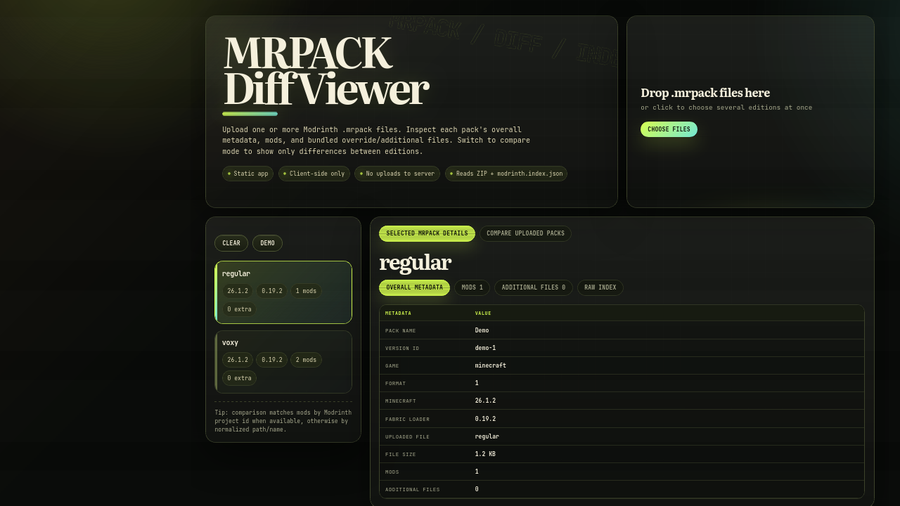

# MRPACK Diff Viewer

A static, client-side viewer for Modrinth `.mrpack` files. It can inspect one pack or compare several pack editions side-by-side.



## Live demo

https://karilaa-dev.github.io/mrpack-diff-viewer/

## Features

- Open one or more `.mrpack` / `.zip` files directly in the browser.
- Reads `modrinth.index.json` from each pack.
- Shows pack metadata, dependencies, mod files, override files, hashes, download URLs, and environment flags.
- Comparison mode shows only differences between uploaded packs.
- Matches mods by Modrinth project id when available, with normalized file/path fallback.
- Missing mods are shown first, then same-mod version/detail differences.
- No server upload: all parsing happens locally in your browser.

## Project structure

- `index.html` — page markup and app shell.
- `styles.css` — visual design and responsive layout.
- `app.js` — MRPACK parsing, rendering, and comparison logic.
- `vendor/jszip.min.js` — bundled JSZip dependency for offline/static hosting.
- `assets/screenshot.png` — README preview image.

## Local development

Run any static file server from the repository root:

```bash
python3 -m http.server 8765
```

Then open:

```text
http://localhost:8765/
```

## Deployment

This repository is published with GitHub Pages from the root of the `main` branch. Pushing changes to `index.html`, `styles.css`, `app.js`, or `vendor/jszip.min.js` updates the live site after Pages rebuilds.

## Privacy

The app does not upload packs anywhere. Files are parsed with JSZip in the browser process only.
